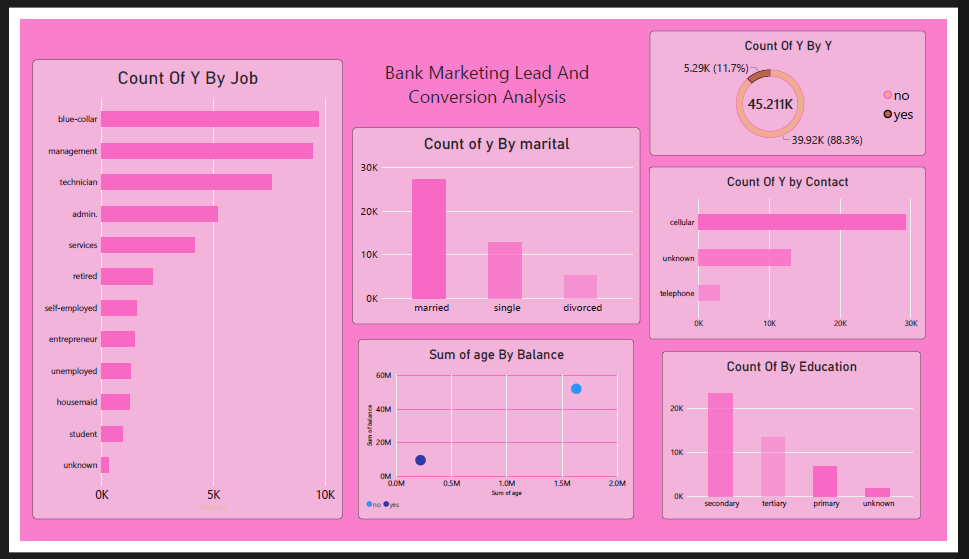

# Bank Marketing Lead & Conversion Analysis 📊

## 📌 Project Overview

This project focuses on analyzing bank marketing campaign data and understanding customer behavior, campaign contacts, and subscription conversion patterns.

The project uses data cleaning with Python and interactive data visualization with Power BI to identify useful insights from the bank marketing dataset.

## 🛠️ Tools & Technologies

- Python
- Pandas
- Jupyter Notebook
- Power BI
- CSV
- Data Cleaning
- Data Visualization

## 📂 Project Files

- `bank-full.csv` – Original bank marketing dataset
- `bank_marketing_cleaned.csv` – Cleaned dataset
- `bank_marketing_cleaned_py.ipynb` – Python notebook used for data cleaning
- `bank_lead analysis powerbi project...` – Power BI dashboard/project file
- `bankanalysis-screenshot.png` – Dashboard screenshot

## 📊 Dashboard

## 📈 Key Analysis

The Power BI dashboard analyzes:

- Customer job categories
- Marital status
- Education level
- Contact methods
- Age and balance
- Subscription outcome
- Marketing lead conversion

## 🔍 Key Insights

- Total customers/leads analyzed: **45.21K**
- Successful conversions: **5.29K (11.7%)**
- Non-conversions: **39.92K (88.3%)**
- Cellular was the most frequently used contact method.
- Married customers represented the largest marital-status category.
- Secondary education had the highest number of customers.
- Job categories such as blue-collar and management had a large share of customers.

## 🎯 Project Objective

The main objective of this project is to analyze bank marketing campaign data and understand customer patterns that can help identify factors related to successful subscription conversions.

## 💡 Skills Demonstrated

- Data Cleaning using Python Pandas
- Exploratory Data Analysis
- Data Visualization
- Power BI Dashboard Development
- Business Data Analysis
- Data Interpretation

## 👩‍💻 Author

**Raja Sekar**

